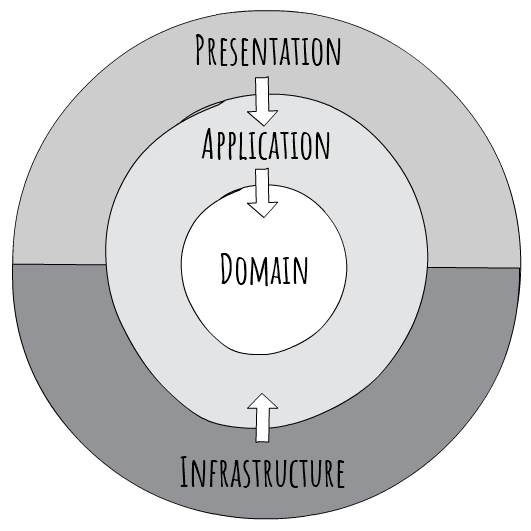

# PaymentGateway

**PaymentGateway** is a sample payment processing system that demonstrates a layered architecture with Domain, Infrastructure, Application, and API projects. It supports validation of payment details, processing of payment commands (with integration to a simulated bank service), and retrieval of payment data. It also comes with a full suite of tests—including unit, integration, and end-to-end (E2E) tests—that illustrate how the various components interact.

---

## Table of Contents

- [Overview](#overview)
- [Solution Structure](#solution-structure)
- [Prerequisites](#prerequisites)
- [Configuration](#configuration)
- [Running the Application](#running-the-application)
- [Authentication](#authentication)
- [Using Swagger](#using-swagger)
- [Using Postman](#using-postman)
- [Testing](#testing)
  - [Unit & Integration Tests](#unit--integration-tests)
  - [End-to-End Tests](#end-to-end-tests)
- [Assumptions](#assumptions)
- [Improvements](#improvements)


---

## Overview

The PaymentGateway solution demonstrates a robust payment processing system. The design of this application inspired by [Jason Taylor's Clean Architecture's template](https://github.com/jasontaylordev/CleanArchitecture).

The obligatory picture of the DDD Onion:



Key features include:

- **Domain Layer:**  
  Contains business entities (e.g., `Payment`), value objects (`CardNumber`, `ExpiryDate`, `Cvv`), enums (`Currency`, `PaymentStatus`), exceptions, interfaces, and validation logic.
  
- **Infrastructure Layer:**  
  Implements authentication using JWT and OpenIddict, dependency injection, and a simple in-memory persistence layer (via IMemoryCache) for storing payments. It also includes a simulated bank service integration.

- **Application Layer:**  
  Contains DTOs, commands, queries, handlers, AutoMapper profiles, and MediatR integration to orchestrate the payment flow.

- **API Layer:**  
  Exposes RESTful endpoints for processing and retrieving payments, along with middleware for global exception handling.

- **Tests:**  
  The repository includes unit tests, integration tests (e.g., for repository and handler interactions), and end-to-end tests (which exercise the full flow including external dependencies like the bank simulator using Docker).

---

## Solution Structure

- **PaymentGateway.Domain**  
  - Contains all business logic, entities, enums, exceptions, interfaces, and validation routines.

- **PaymentGateway.Infrastructure**  
  - Implements external dependencies such as persistence (PaymentRepository), authentication (JWT & OpenIddict), and external service integration (BankService).
  - Contains settings classes for configuring bank service endpoints and authentication parameters.

- **PaymentGateway.Application**  
  - Contains DTOs, commands (e.g. `ProcessPaymentCommand`), queries (e.g. `GetPaymentByIdQuery`), handlers (e.g. `ProcessPaymentHandler` and `GetPaymentByIdHandler`), mapping profiles, and MediatR integration.
  
- **PaymentGateway.Api**  
  - The Web API project exposing endpoints to process and retrieve payments.
  - Contains controllers (e.g. `PaymentsWriteController` and `PaymentsReadController`) and middleware for exception handling.
  - Configuration is managed via `appsettings.json`, with launch settings specifying multiple URLs.

---

## Prerequisites

- [.NET 6 or later](https://dotnet.microsoft.com/download)
- [Docker & Docker Compose](https://docs.docker.com/get-docker/) – for running the bank simulator
- (**Optional**) An IDE like [Rider](https://www.jetbrains.com/rider/), [Visual Studio](https://visualstudio.microsoft.com/) or [VS Code](https://code.visualstudio.com/)

---

## Configuration

- **appsettings.json:**  
  Contains default configuration values.

- **Launch Settings:**  
  In `PaymentGateway.Api`’s launch settings, you’ll see `applicationUrl` defined as multiple URLs (e.g., `https://localhost:7092` and `http://localhost:5067`). The tests and the API pick up these settings to bind to the correct endpoints.

- **Environment Variables:**  
  The environment is set via `ASPNETCORE_ENVIRONMENT` (e.g., `Development` or `Test`).

---

## Running the Application

1. **Restore and Build:**  
   From the root folder, run:
   ```bash
   dotnet restore
   dotnet build
   ```

2. **Run the Bank Simulator:**  
You can run the Bank Simulator via the command line:
```bash
   docker-compose up
```
3. **Run the API:**  
You can run the API project (PaymentGateway.Api) from your IDE or via the command line:
```bash
   dotnet run --project PaymentGateway.Api
```
The application will listen on the URLs specified in the launch settings.

2. **Run the API:** 
If running in Development, navigate to `https://your.endpoint/swagger` to explore the API endpoints.

## Authentication

The PaymentGateway API uses JWT tokens for both authentication and authorisation. To access protected endpoints, you must first obtain a valid token from the authentication server by sending a request to the `/connect/token` endpoint on the same host where the API is running.


For example, to request a token you can issue an HTTP POST to:

`https://your.endpoint/connect/token`

This endpoint supports the resource owner password grant, so you can provide credentials (username and password can be found [here](./src/PaymentGateway.Api/Postman/)) along with the required scope(s). The returned token contains claims including the `merchantId`, which is then used by the API to identify the merchant making the request.

You can also view additional details about the authentication configuration and metadata by visiting the OpenID Connect discovery endpoint:

`https://your.endpoint/.well-known/openid-configuration`


This endpoint provides information on available endpoints, signing keys, and other configuration details.

Since the `merchantId` is provided within the API token, you are required to first get a token from the auth server before making requests to protected endpoints. More details on obtaining and using the token can be found in the [Using Postman](#using-postman) section.

## Using Swagger

When you run the application, the Swagger UI will open, allowing you to interact with the API for processing and retrieving payments. Use the **`Authorize`** button to obtain the necessary API token. The required username and password are provided in [this Postman Environment file](./src/PaymentGateway.Api/Postman/PaymentGateway%20Local.postman_environment.json). Enter them and that's all that's required to gain access. Simply enter these credentials and click **`Authorize`** to gain access.

Once authorised, you can use the Swagger interface to make POST and GET requests to the payment endpoints.

## Using Postman

Alternatively, if you prefer using Postman, a Postman collection and environment file are provided to facilitate seamless API testing and exploration. 

You can find these files in the [**Postman folder**](./src/PaymentGateway.Api/Postman/):

- **PaymentGateway.postman_collection.json:** Contains all the API endpoints, requests, and associated tests.
- **PaymentGateway.postman_environment.json:** Contains environment variables such as `baseUrl` (e.g., `https://localhost:7092`) and `bearerToken` to be used across requests.

#### How to Use

1. **Import the Collection:**
   - Open Postman.
   - Click on **Import** in the top-left corner.
   - Select the **PaymentGateway.postman_collection.json** file from the **Postman** folder.

2. **Import the Environment:**
   - Click on the gear icon in the top-right corner of Postman and select **Manage Environments**.
   - Click **Import** and select **PaymentGateway.postman_environment.json** from the **Postman** folder.
   - Activate the imported environment by selecting it from the dropdown in the top-right.

3. **Run the Application and Bank Simulator:**
    - You can run the application and simulator following [these instructions](#running-the-application).
   
4. **Run Your Requests:**
   - With the environment activated, you can now send requests to your API endpoints. The collection is pre-configured to use variables such as `{{baseUrl}}` and `{{bearerToken}}` for seamless testing.

5. **SSL Certificate Verification:**
   - When using Postman, you may need to disable SSL certificate verification for the duration of your session, as the API is running on a local development certificate. To do this, go to **Settings** in Postman and turn off **SSL certificate verification**.

This setup allows you to quickly start testing the PaymentGateway API using Postman with minimal configuration.

## Testing
### Unit & Integration Tests

- **Unit Test:**  
  Test individual components in isolation (e.g., domain validation, utility methods).
Run using:
```bash
   dotnet test --filter Category=Unit
```

- **Integration Tests:**  
  Verify interactions between components such as:
*PaymentRepositoryIntegrationTests* – testing persistence.
*ProcessPaymentHandlerIntegrationTests* – testing the complete flow from processing a payment through the handler.
Run using:
```bash
   dotnet test --filter Category=Integration
```

### End-to-End Tests
The end-to-end tests in the PaymentGateway.Api.End2EndTests project cover the full payment workflow:

- **ExternalServicesFixture:**  
  Spins up the bank simulator using Docker Compose. 

- **IntegrationTestFixture:**  
  Configures and starts the API in a test environment with test-specific configuration (e.g., valid issuer, base URLs).

- **PaymentE2ETests:**  
  Tests the entire flow:
  - Obtaining an access token via the /connect/token endpoint.
  - POSTing a payment request.
  - GETting the payment by its ID.

  Run these tests with:
  ```bash
   dotnet test --filter Category=E2E
   ```

## Assumptions

The design and implementation of the PaymentGateway solution is based on a number of key assumptions:

- **Bank Service Behaviour:**  
  - Banks may be slow to process requests or could fail intermittently. The system is designed to handle such scenarios gracefully, with appropriate error handling and fallback mechanisms.
  - A simulated bank service is used (via Docker Compose) for testing and demonstration purposes.

- **Merchant Identification:**  
  - The `merchantId` is derived from the API token (or API key) provided with each request. This token contains a claim (e.g. `merchant_id`) that identifies the merchant.

- **Persistence:**  
  - No external database is required for this demonstration. Instead, an in-memory cache is used to store payment data.
  - This assumption simplifies the architecture for a take-home task, though a production system would use a persistent storage solution.

- **Design Approach (DDD):**  
  - The application is designed following Domain-Driven Design (DDD) principles, with a clear separation between the Domain, Infrastructure, Application, and API layers.
  - Domain models encapsulate business logic and validation, ensuring that invalid data is rejected early.

- **Authentication & Authorisation:**  
  - JWT tokens are used for authentication and authorisation, with token generation handled via OpenIddict.
  - The API requires tokens for accessing protected endpoints, and these tokens include claims for both scope and merchant identification.
  - It is assumed that a development certificate is used for HTTPS during development, and that any SSL certificate issues can be bypassed (e.g., in Postman).

- **Error Handling:**  
  - Global exception handling middleware is in place to catch and return meaningful HTTP error responses for issues such as invalid payment data, duplicate payments, or failed external service calls.

- **Testing and Documentation:**  
  - A comprehensive test suite is included, with unit tests, integration tests, and end-to-end tests
  - Swagger/OpenAPI is used to document the API endpoints, allowing for easy exploration and testing.

## Improvements

While the PaymentGateway solution fulfils the requirements for this take-home task, there are several areas for improvement if transitioning to a production-ready system:

- **Persistence:**  
  Currently, the application uses an in-memory store (`IMemoryCache`) for storing payment data. In a production environment, this should be replaced with a robust datastore. A database might be appropriate for scalability and flexibility, or a relational database if transactional integrity is required.

- **Resilience and Fault Tolerance:**  
  The current bank service integration is basic and may not handle transient failures well. Implementing resilience patterns—such as retries, circuit breakers, and fallback mechanisms will improve the system's ability to cope with slow or failing external services.

- **Merchant Management:**  
  The system currently derives the merchant ID from the API token. A more robust approach would be to maintain a pre-defined list of merchants and their details in a secure datastore, ensuring proper management and validation of merchant data rather than relying solely on token claims.

- **Duplicate Payment Prevention:**  
  To avoid accidental duplicate payments, consider utilising idempotency keys supplied by clients to ensure that each payment request is unique. In addition, implement database constraints (for example, a unique hash based on critical payment details) and business logic that checks for identical transactions within a defined time window - the combination will help to prevent duplicate transactions from being processed.

- **Monitoring and Metrics:**  
  Integrating API metrics with tools such as Azure App Insights/Dashboards or with Prometheus (and visualising with Grafana) would enable real-time monitoring of API performance and health, facilitating proactive management and alerting.

- **Logging and Centralised Observability:**  
  Incorporate structured logging using a framework like Serilog, and connect it to a centralised logging platform. This will enhance observability, making it easier to diagnose issues and monitor system behaviour in production.

- **Authentication Architecture:**  
  Authentication is currently handled on the same server as the API via OpenIddict, meaning the API and authentication server are located in the same place. In a production scenario, it might be beneficial to separate these concerns into distinct services to improve scalability, security, and maintainability.

Implementing these improvements would help evolve the PaymentGateway solution from a demonstration project into a robust, scalable, and production-ready system.
